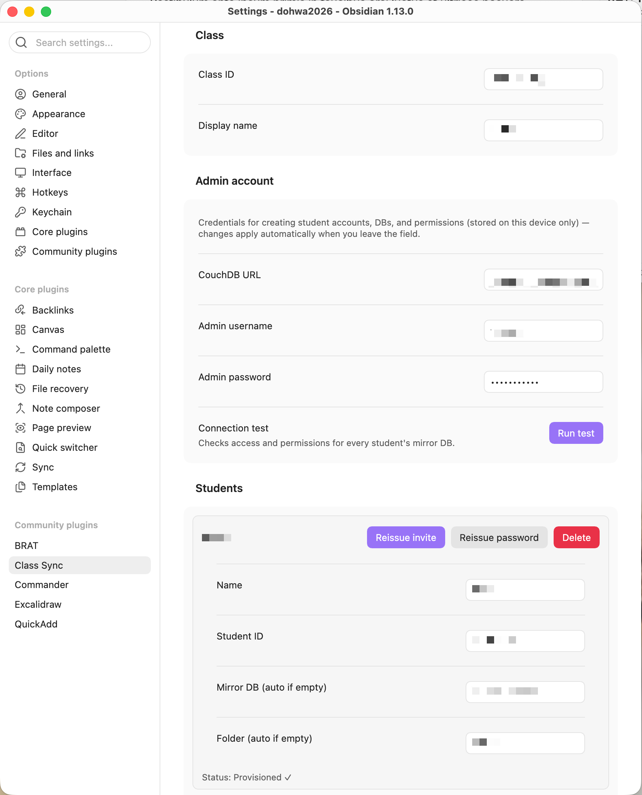

# CoVault for Obsidian

> **English** · [한국어](README.ko.md)

An Obsidian plugin that two-way syncs a manager's **per-member folders** with each member's **personal vault**.
It uses self-hosted **CouchDB** (e.g. on a Synology NAS) as the central server, with **PouchDB** on the client.

```
ManagerVault/
├─ Member A/  ⇄  mirror_member_a  ⇄  Member A Vault/
├─ Member B/  ⇄  mirror_member_b  ⇄  Member B Vault/
└─ Member C/  ⇄  mirror_member_c  ⇄  Member C Vault/
```

You ship a single plugin; on first run each user picks the **Member Mode** or **Manager Mode** role.
Members write notes in their own vault as usual, while the manager manages per-member folders from one vault.

Highlights:
- **Offline-first** — local PouchDB ↔ remote CouchDB live replication. Changes queue while offline and propagate on reconnect.
- **QR/code invites** — inviting a member auto-provisions a least-privilege account that can **only access their own mirror DB** (no admin credentials). If an invite leaks, the manager can **'Reissue password'** to immediately invalidate the old invite.
- **Server-enforced isolation** — per-member data is isolated on the server by per-database permissions (`_security`).
- **Markdown + attachments** — not only notes but images, PDFs, etc. are synced (PouchDB attachments).
- **Conflict preservation** — on simultaneous edits the local copy is kept and you compare/choose in the conflict UI. For both markdown and attachments the remote copy is preserved under `_충돌/` (Conflicts).
- **Shared folders** — a group/workspace shares one folder (dedicated DB + member permissions), auto-propagated to members by manager deploy.
- **Realtime co-editing** — character-level co-editing of shared-folder notes via Yjs. For **both markdown and Excalidraw**, cursors/names + a **participant chip** (always shown at the bottom-right) reveal who is co-editing — even on tablets/phones without a mouse (image sync; the Excalidraw plugin is required). A separate WebSocket server is needed.
- **Realtime control & access** — a dedicated **Realtime tab** manages live editing: an on/off toggle, **per-file participant assignment** (only the members you pick co-edit a given note; others stay on plain file sync), an optional **shared-files read-only** policy (members can only edit a shared note while it's an active realtime session for them), and a live **active-sessions list** (open assigned files with one click — they stay listed even when closed). Removing a member from a file ends their live session immediately.
- **Realtime security** — realtime tokens are issued as **per-shared-space HMAC-signed tokens**, so a leaked token only grants access to **that space's room** (not the whole workspace). The server refuses to start with a known placeholder secret, and the manager's tokens/secret are kept in **Obsidian Secret Storage** (not plaintext in `data.json`).
- **Messenger** — a built-in **chat tab**: a **class-wide channel** (homeroom shared DB) and **1:1 DMs** (manager↔member, over the personal mirror DB). Send text, **`[[wikilink]]`s with Obsidian-style autocomplete**, URLs, and **file/image attachments** (the file is copied to the other side); links and image previews render inline. Sender names show for everyone (not raw IDs).
- **Feedback layer** — leave comments anchored to text without editing the body (on shared and personal notes). The manager can review scattered feedback at once with the **all-unresolved feedback inbox**. Periodic in-session snapshots are also supported.
- **Classroom dashboard** — an optional manager↔member workspace built on one auto-provisioned **homeroom** shared space: **notices** (read-confirm + class comments + private questions/replies), a **weekly timetable + lessons**, **assignments** (distribute → submit with version snapshot → grade by score/rubric/comment → return), **checklists/routines**, and a **statistics** view (read/submission/score/completion rates, CSV export). Notices and lessons are authored **right in the Obsidian editor using frontmatter** (draft → publish toggle), and notices/lessons/assignments support **reusable content templates**.
- **Operational UX** — manager **onboarding wizard** ('Get started' checklist), **bulk member import** (paste a roster with an optional per-member folder) and **bulk invite** for all pending members, **deploy preview (dry-run) + per-member result & retry-failed**, an **action-oriented dashboard** (action cards + narrow-screen card layout), and inline settings validation (duplicate ID / URL / folder-overlap warnings).
- **Operational convenience** — settings export/import (credentials excluded), full diagnostics (server · read/write permissions · realtime), mobile power-saving (pause background sync · pre-check large files), and a configurable max-delete-reconcile limit.

### Requirements
- **Obsidian 1.11.4+** (desktop and mobile). 1.11.4 is required because the plugin uses the Secret Storage API.
- **Self-hosted CouchDB** (e.g. Synology NAS) — the required central server. [Setup](server/README.md#couchdb-required).
- **Yjs WebSocket server** — only needed for realtime co-editing. Per-space HMAC tokens (`YJS_SECRET`) recommended ([setup](server/README.md#yjs-realtime-server-optional), runtime files in [`server/yjs/`](server/yjs/)).
- **Excalidraw plugin** — only needed for realtime co-editing of Excalidraw drawings (that feature auto-disables if not installed).

---

## Screenshots

| Manager settings | QR invite |
|---|---|
|  |  |

| Realtime co-editing | Feedback panel |
|---|---|
|  |  |

---

## Status

| Phase | Content | State |
|---|---|---|
| **0** | Technical-validation POC (connect · put/get · changes · guard · mobile) | ✅ Verified on Mac·iOS |
| **1** | Single-member two-way mirror + rename/delete/purge + offline conflict (preserve-local) | ✅ Verified |
| **2** | Multi-member Manager Mode + secure invite (QR) + auto-provisioning | ✅ Verified |
| **3** | Conflict-resolution UI (view/choose/keep) + member status dashboard | ✅ Verified |
| **4** | Manager convenience — copy files/folders to members + template variables | ✅ Verified |
| **5** | Attachment (image/PDF) sync | ✅ |
| **6a** | Shared folders (group/workspace sharing, file-level) | ✅ |
| **6b** | Yjs character-level realtime co-editing | ✅ |
| **6c** | Feedback layer (anchored comments) + periodic in-session CouchDB snapshots | ✅ |
| **Stabilization** | Settings export/import · full diagnostics (read/write permissions) · mobile power-saving (background pause · large-file pre-check · debounce) | ✅ |
| **Security/consistency hardening** | Per-space HMAC realtime tokens · invite password reissue (revoke) · manifest-based offline delete reconcile (bulk-delete threshold) · attachment conflict preservation · unit tests + CI gate | ✅ |
| **Operational UX** | Manager onboarding wizard · bulk member import · deploy preview/result report · action-oriented dashboard (action cards · narrow card layout) · all-unresolved feedback inbox · simplified member home · shared-space operational badges | ✅ |
| **Realtime chips · security** | Markdown & Excalidraw participant chips (unified name/color) · Yjs secret in Secret Storage · faster startup (onLayoutReady) · plugin-guideline compliance (Vault.process, etc.) | ✅ |
| **Classroom dashboard** | Homeroom space · notices (read-confirm/comments/private questions) · weekly timetable + lessons · assignments (distribute/submit/grade/return) · checklists/routines · statistics (CSV) · editor+frontmatter authoring (draft→publish) · content templates | ✅ |
| **Messenger** | Class channel + 1:1 DM · text / wikilink (autocomplete) / URL / file·image attachments · inline link & image rendering · names not IDs | ✅ |
| **Realtime control & access** | Realtime tab (toggle · in-session snapshot interval) · per-file participant assignment · shared-files read-only enforcement (markdown + Excalidraw) · active-sessions list / one-click reopen · live de-gate on removal | ✅ |

---

## Install

### ① Community plugin (after review)
Settings → Community plugins → Browse, search **CoVault**, install and enable.

### ② Manual install (release assets)
From [Releases](https://github.com/wakeyi-git/obsidian-covault/releases), download the latest
**`main.js` · `manifest.json` · `styles.css`**, put them in `<vault>/.obsidian/plugins/covault/`, and enable.

### ③ BRAT (beta testing)
In the [BRAT](https://github.com/TfTHacker/obsidian42-brat) plugin, add the repository `wakeyi-git/obsidian-covault`.

### Development build
```bash
git clone https://github.com/wakeyi-git/obsidian-covault.git
cd obsidian-covault
npm install
npm run build      # produces main.js (use npm run dev to watch during development)
```
Copy the three outputs to the path in ② above.

> **Mobile (iOS/Android)**: put the same three files at the same path in your phone vault. If the vault syncs via
> iCloud, files copied on desktop follow to the phone. After applying, fully quit and reopen the Obsidian app.

---

## Server setup

CoVault uses **two independent servers** — **CouchDB** (file sync, required) and a **Yjs WebSocket server**
(realtime co-editing, optional). They **never talk to each other** (the plugin is the only client of both), so they can
share one box or run on entirely different providers; the only hard requirement is that **every client (manager + all
members) reaches each one over HTTPS/WSS**.

Full setup lives in **[`server/README.md`](server/README.md)** — Docker commands, hosting options
(NAS / Raspberry Pi / VPS / PaaS / Cloudant), the architecture and constraints, and the realtime server's security
(reverse proxy `wss://`, `YJS_SECRET`, access-log masking). The realtime server's runtime files are in
[`server/yjs/`](server/yjs/).

---

## Usage

On first run the role-selection screen appears. The role locks once chosen; to change it use 'Reset role' in settings.

### Manager (Manager Mode)
1. Settings → enter the **admin account** (CouchDB URL / admin username·password) — stored on this device only.
2. In the **member list**, `+ Add member` (or `Paste roster` for bulk — each line `Name,ID,Folder` with ID/folder optional, plus an optional base folder) → enter name and member ID (Mirror DB/folder auto-fill if blank).
3. Click **Invite** on a member card (or **Invite all** to provision every pending member at once) → the plugin auto-creates the account/DB/permissions and shows a **QR + invite code**.
4. Run **Test connection** to verify access to all member DBs, then **Apply settings** to start syncing.

> Managers can follow the **'Get started' tab (onboarding wizard)** in the panel: server connection → workspace info → add members → invite → first sync, in order.

### Member (Member Mode)
- **Scan the manager's QR with the phone's default camera** → Obsidian opens and configures automatically, or
- **Paste the invite code** (first-run screen or Member settings).
- The member connects with a dedicated account that can only access their own mirror DB.

### Commands (`Cmd/Ctrl+P` → `CoVault:`)
The single **🎓 ribbon** opens the unified panel; the commands below open a specific tab or action.

| Command | Action |
|---|---|
| Open panel / Open dashboard | Open the panel; "Open dashboard" jumps to the classroom **Dashboard** tab |
| Full sync / Upload only / Download only | Manual reconcile (Manager: all members) |
| Test connection/permissions | Verify CouchDB connection and permissions |
| Run full diagnostics | Check server reachability + DB read/write permissions + realtime status at once |
| Add feedback / Open feedback panel | Anchored comment on a selection; list/jump/resolve in the panel |
| Toggle auto-sync | Toggle realtime watching/subscription |
| Reset local cache | Delete local PouchDB and re-fetch from server |
| Open conflicts | Compare/resolve conflicts (keep local · apply remote · keep both) |
| Open sync status | Per-member sync status table — also hosts the **management tools** (test connection · diagnostics · realtime status · reset cache · reset server / refresh shares) |
| Copy to members (open deploy tab) | Pick a path (file/folder) in the deploy tab and deploy to members — substitutes `{{memberName}}`, etc. |
| Check realtime status / Open version history | Realtime diagnostics; per-note version snapshots |
| Open log panel | View the sync log |

Deleted files move to the **archive folder (`_삭제됨/`, configurable)**; deleting from that folder permanently purges from the DB.

### Conflicts
When both sides edit the same file differently, the local copy is preserved (preserve-local) and the remote version is
pulled into the **`_충돌/` (Conflicts) folder**. In `Open conflicts`, compare and resolve via *keep local / apply remote /
keep both*. If the other side resolves first and your edit would be overwritten, your version is kept as `_충돌/<file>.내편집.md`.

### Attachments
Non-markdown files like images and PDFs are also synced (CouchDB attachments). Control them with the *Sync attachments*
toggle and *Max attachment size (MB)* in settings (mobile protection). Attachment conflicts also appear in the conflict
list and can be resolved (keep local / apply remote / keep both). There is no binary content diff — the file name, size,
and MIME type are shown and the remote copy is preserved in `_충돌/`.

### Manager deploy
Keep originals outside member folders (e.g. in `Templates/`), then in the **deploy tab** pick a path (quick buttons:
current file / current folder; an empty target path uses the original name) and deploy to selected/all members.
Use **Preview (dry-run)** to see each member's target and action first; after running, per-member results
(written/skipped/failed) and a **retry-failed** action remain in the panel. The variables `{{memberName}}` `{{memberId}}`
`{{workspaceId}}` `{{date}}` are substituted per member, and existing files are handled with a skip (default) / overwrite / rename policy.

### Shared folders
Under *Shared spaces* in manager settings, create a group/workspace space, pick member members, and **Deploy** — a dedicated
DB (`share_*`) and permissions are created and auto-propagated to members. The same folder appears in each member's vault
so they can see and edit each other's files. To avoid overlapping the personal mirror, shared folders are auto-excluded
from personal sync. Simultaneous edits of the same file are resolved via the conflict UI. Each shared-space card shows an
operational badge (not deployed / deployed / members changed — redeploy needed).

### Realtime co-editing
> **Optional / advanced.** The core of CoVault is CouchDB **file sync**, which works fully without realtime.
> Get file sync working first, then enable realtime only when needed.

Co-edit shared-folder notes character-by-character (Yjs). A separate **Yjs WebSocket server** (independent of CouchDB
file sync) is required; once the manager enters the server URL and space secret in settings and deploys a shared space,
it propagates to members automatically. Opening a shared-folder note in edit mode connects a realtime session and shows
each other's cursors/names. While editing, Yjs is authoritative; when the note closes, a snapshot is saved to CouchDB so
offline members get it (someone who joins the session later also receives the latest shared content immediately).
Enabling **In-session snapshot interval (sec)** in settings also persists the body to CouchDB periodically before
closing, so non-realtime/offline members get the latest sooner (only one leader writes, preventing conflicts). A
**participant chip** (name + color) is always shown at the bottom-right of the editing area so you can see who's
co-editing even without a mouse (same for markdown and Excalidraw); on touch devices you can double-tap to enter text
and the pointer follows your swipe immediately.

**Realtime control & access (Realtime tab).** The manager controls live editing from the **Realtime tab**: the on/off
toggle and **in-session snapshot interval** are grouped at the top, followed by an optional **shared-files read-only**
policy and the **active-sessions list**. With read-only on, members can't freely edit shared notes — a note becomes
editable only while it's an active realtime session **for that member**. You choose who co-edits **per file**: open a
note, and in its highlighted session card pick the participating members (default depends on the read-only policy —
*nobody* when read-only is on, *everyone* when off). Only the chosen members join the live session; the rest stay on plain
file sync. Each card also lists who's co-editing **by name**, and assigned files stay in the list even when closed so you
can reopen them with one click. Removing a member from a file **ends their live session immediately** (and re-locks the
note under the read-only policy). Excalidraw drawings are locked/unlocked the same way (view mode). Troubleshooting
actions (reissue/redeploy tokens, check realtime status) live in a separate section of the tab. Members get a slim
Realtime tab that shows only the sessions they're assigned to.

To run the Yjs server, see **[`server/README.md` → Yjs realtime server](server/README.md#yjs-realtime-server-optional)** (runtime files in [`server/yjs/`](server/yjs/)).

**Realtime token security** — set `YJS_SECRET` on the server and the same value in the plugin's **'Yjs space secret (HMAC)'**;
then each time the manager deploys a space, a **per-shared-space signed token** is issued and delivered to members. The
token payload carries `workspaceId`·`spaceId` (+ optional expiry) and the server verifies that the connecting room starts with
`<workspaceId>/share/<spaceId>/`, so a leaked token only grants access to **that space's room** (not the whole workspace). Changing the
secret/members and redeploying refreshes tokens, and **'Space token expiry (days)'** sets a TTL. The manager's tokens/secret
are stored in Obsidian Secret Storage. Realtime auth is **HMAC-only** — every token is scoped to a single shared space.
The token is sent over WSS (not exposed in transit); keep it out of reverse-proxy/CDN/monitoring access logs by masking query strings (see [`server/README.md`](server/README.md)).

**Excalidraw drawings** also support **element-level realtime co-editing** in shared folders (add/move/delete, named/colored
cursors, image sync). The [Excalidraw plugin](https://github.com/zsviczian/obsidian-excalidraw-plugin) must be installed
(auto-disabled if not), and the binding uses [`y-excalidraw`](https://github.com/RahulBadenkal/y-excalidraw) (MIT). Each
user's zoom/scroll is independent while shapes/cursors are shared in scene coordinates. Realtime supports the
**`.excalidraw.md` format only** (the session-end snapshot needs a markdown path to propagate to CouchDB — plain `.excalidraw` auto-disables with a notice).

### Feedback layer
**Anchor-based comments** that leave feedback without editing the body (design §19.5). Select text in a note and run
"Add feedback" to save the quote and position; it appears as a list in the **feedback panel** and clicking jumps to that
location. You can resolve/delete. The panel's **'Show all unresolved'** toggle shows unresolved feedback across all notes
at once (with member/note labels + jump-to). Feedback documents are stored in the DB the target note belongs to (personal
mirror or shared) and propagate via the existing sync; they are metadata, not files, so nothing is written to the vault.
Works on both shared-folder notes and regular member mirror notes.

### Messenger (chat)
The **Chat** tab provides a **class-wide channel** and **1:1 DMs** between the manager and each member. The class channel
rides the **homeroom** shared DB (so it needs a homeroom space); DMs ride each member's **personal mirror DB**. Besides plain
text you can send **`[[wikilinks]]`** (type `[[` for Obsidian-style file autocomplete), **URLs**, and **file/image
attachments** — an attached file is copied into the channel's attach folder so the other side actually receives it, and
links/image previews render inline (click to open). Messages carry the author's display **name** so everyone sees names
rather than raw member IDs.

### Classroom dashboard
> **Optional.** Turns the manager↔member sync into a lightweight classroom workspace. Skip it if you only need file sync.

Mark one shared space as the **homeroom** (settings → a shared space → "Set as homeroom"); it is auto-provisioned to all
members and powers the **Dashboard** tab (open it from the 🎓 ribbon). Content lives as normal markdown files under the
homeroom folder, while lightweight state (read receipts, submissions, grades, checklist ticks) lives in the DB and syncs
with everything else. Modules:

- **Notices** — write announcements **in the Obsidian editor**: "New notice" creates a draft note (from a template) with
  frontmatter, which you fill in and then **Publish** (a `published` property / button — members only see published ones).
  Members read-confirm and leave **comments** (class-visible) or **questions** (private to the manager); the manager can
  reply inline. Edit (open the note) and delete from the card.
- **Lessons & timetable** — a **weekly timetable grid**; each cell can link a **lesson** note (same editor+frontmatter
  flow as notices), navigable by week/day.
- **Assignments** — created in a dialog (title, due, points, **visibility: private per-member or shared**, target members,
  **rubric**, template). On create it **distributes** a work file to each target (their mirror or the shared folder) and a
  status doc. Members **turn in** (a version snapshot is taken); the manager **grades** (score / rubric / comment) and
  **returns**. Assignments can be **edited** (re-distributes, preserving submissions/grades) or **deleted**.
- **Checklists / routines** — daily/weekly checklist items; members tick them off and the manager sees per-member
  completion (drag to reorder).
- **Statistics** — per-member rates for notice/lesson reads, assignment submission, average score, and checklist
  completion, with **CSV export**.

**Content templates** — under settings → *Content templates*, set a template file per type (notice / lesson / assignment),
or leave blank to use the built-in default; "Create default" writes a starter template into the vault you can customize.

---

## Architecture

```
src/
├─ main.ts                     # Entry point, role setup, invite deep-link handler, commands
├─ settings/                   # Settings types + settings tab (member-card UI) + validation/roster parsing
├─ core/
│  ├─ couch/
│  │  ├─ PouchService.ts       # Local PouchDB + live sync (retry) + changes
│  │  ├─ obsidianFetch.ts      # requestUrl-based fetch shim (mobile CORS bypass)
│  │  └─ CouchAdmin.ts         # Member account/DB/_security provisioning (admin)
│  ├─ invite/invite.ts         # Invite payload encoding + obsidian:// deep link
│  ├─ realtime/                # Yjs realtime (RealtimeManager · editorBinding · excalidrawBinding · presenceChips · spaceToken = per-space HMAC token)
│  ├─ feedback/FeedbackStore.ts # Feedback layer (anchored comments) store/query/sync
│  ├─ classroom/               # Classroom dashboard core (ClassroomStore · notices · assignments · templates · week · homeroom)
│  ├─ guard/RemoteApplyGuard.ts# Sync-loop guard
│  ├─ secret.ts                # Obsidian Secret Storage wrapper (Yjs space secret · CouchDB password)
│  ├─ sync/
│  │  ├─ MirrorContext.ts      # Per-link path/IO/state/archive helpers
│  │  ├─ MirrorApplier.ts      # Remote→local apply (_conflicts preserve-local, delete/purge)
│  │  ├─ Uploader.ts           # Local→remote (hash dedupe, tombstone, purge)
│  │  ├─ LocalWatcher.ts       # Vault watch (create/modify/rename/delete)
│  │  ├─ LocalApplier.ts       # Local changes → vault (incremental last_seq)
│  │  ├─ FullSync.ts           # Full reconcile (up/down/both) + manifest-based offline delete reconcile
│  │  ├─ LinkManifest.ts       # Per-link held baseline (_local) — safe delete reconcile / bulk-delete threshold
│  │  ├─ ConflictManager.ts    # Conflict remote-copy create/resolve/keep-my-edit
│  │  ├─ MirrorSync.ts         # The member↔DB link engine tying the above together + state
│  │  └─ connectionTest.ts     # Connection/permission test
│  ├─ path/  hash/  log/       # Path mapping · contentHash · logger
│  └─ model/types.ts           # Document model (note / asset / tombstone · classroom: notice/response/timetable/assignment/routine · message · rtpart [per-file participants] / rtconfig)
├─ modes/                      # CoVaultMode / MemberMode / ManagerMode / manager/BulkCopy + domain controllers (Classroom · Realtime · Member)
└─ ui/                         # Unified panel (Dashboard · Chat · Feedback · Realtime · Deploy · Sync status [+ manage tools] · Recovery · History · Log) · panel/dashboard/* (notices/timetable/assignments/routines/statistics) · RoleSetupModal · InviteModal/BulkInviteModal · AssignmentCreateModal · GradingModal · RoutineEditModal · ConfirmModal · ResetModal · BackupModal · MemberBulkImportModal
```

**Sync structure (offline-first)**
```
Vault  ◄──(LocalWatcher / LocalApplier)──►  local PouchDB  ◄──(live sync, retry)──►  remote CouchDB
```
The manager keeps one `MirrorSync` per member to sync many members at once.

---

## Security notes

- **Invite codes** contain the member's private password (for a one-time organization onboarding, base64-encoded). They have
  no built-in expiry, but if a leak is suspected the manager can rotate the password via **'Reissue password'** on the
  member card, **immediately invalidating the old invite**.
- **Realtime tokens** are issued as per-space **HMAC-signed tokens**, so a leak only grants access to that space's room
  (`workspaceId`·`spaceId` binding + optional expiry). The server refuses to start with a placeholder/too-short secret like
  `CHANGE_ME`, and tokens travel over WSS so they aren't exposed in transit (mask query tokens in server/proxy logs).
- **The Yjs space secret** (manager) and **CouchDB admin password** are stored in **Obsidian Secret Storage** (a per-vault
  store), not left in plaintext in `data.json`.
- **Settings export** excludes credentials — admin password, member passwords, `yjsSecret`, space tokens, and device-specific values.
- The manager's admin credentials are stored only on the manager's device; members never handle admin permissions.
- Inter-member data is isolated on the server by CouchDB `_security` (403 when accessing another member's DB).
- **Offline delete reconcile** uses a per-device manifest baseline (content verification + rev/hash comparison) and a
  **bulk-delete threshold** to prevent mass-tombstone accidents from a misconfigured folder. If `localRoot` changes, the
  baseline is invalidated and delete reconcile is skipped.

---

## License

[MIT](LICENSE)
